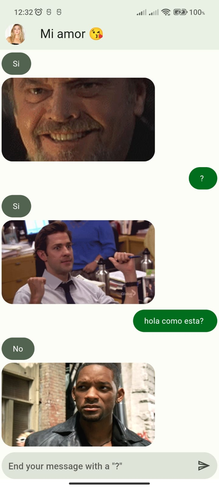

# Flutter Chat Application

This is a simple chat application developed in Flutter that uses the "https://yesno.wtf/api" API to get real-time yes or no answers.

## Description

The chat application allows users to send a question mark ("?") to the API server and receive a random response of yes, no, or maybe. It is a simple demonstration application to showcase how Flutter can interact with an external API and display results in real-time in a chat interface.

## Screenshots

## Usage

To use the application, follow these steps:

1. Clone this repository to your local machine: